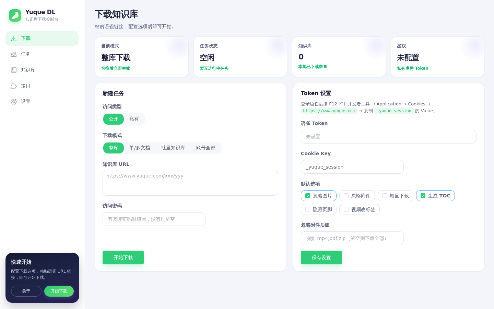
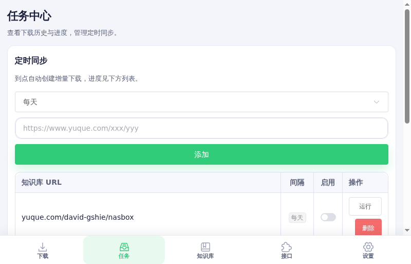
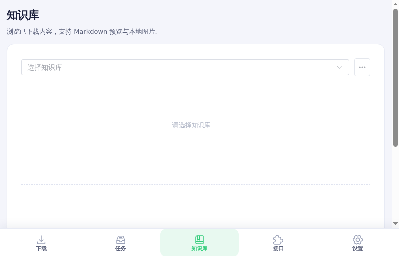
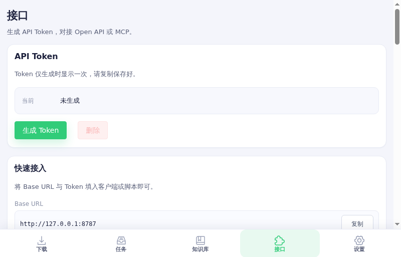
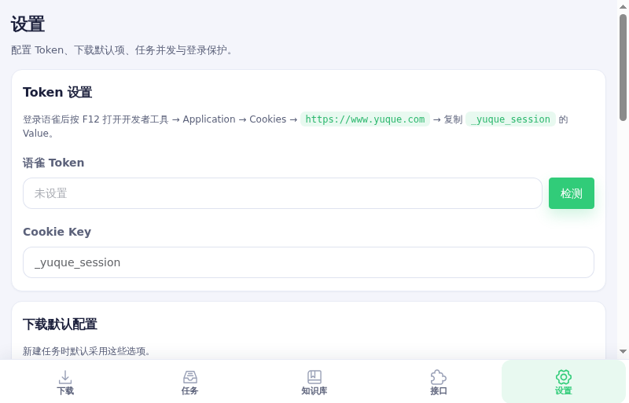

# YuqueDL

语雀知识库 **Web 控制台**：把知识库下载为本地 Markdown，并提供任务管理、实时日志、知识库预览、定时同步、ZIP 导出，以及 Open API / MCP 接入。

> 下载引擎基于 [gxr404/yuque-dl](https://github.com/gxr404/yuque-dl) 的核心能力二次开发与整合；本仓库面向 **可视化控制台**，不再维护原 CLI / npm 发布形态。

## 功能

| 模块 | 能力 |
|------|------|
| 下载 | 整库 / 单多文档 / 批量 / 账号全部；公开 / 私有访问类型 |
| 任务中心 | 进度与 SSE 日志、取消 / 重试、定时同步规则 |
| 知识库 | 目录树、Markdown 预览、导出 ZIP、删除 |
| 设置 | 语雀 Token、默认下载选项、并发、自动刷新、登录保护 |
| 接口 | Bearer Token 的 Open REST 与 MCP Tools |

## 界面预览

| 下载 | 任务 |
|:----:|:----:|
|  |  |

| 知识库 | 接口 |
|:----:|:----:|
|  |  |

| 设置 |
|:----:|
|  |

## 要求

- Node.js **≥ 18.4**
- 包管理推荐 **pnpm**

## 快速开始

```bash
# 安装依赖（根目录 + web）
pnpm install
pnpm --dir web install

# 构建下载核心 + 启动开发服（默认 8787）
pnpm run dev:web
```

打开 http://localhost:8787/

生产构建：

```bash
pnpm run build:web
pnpm run start:web
```

## Docker

```bash
docker compose up -d --build
# http://localhost:8787/
```

详见 [docs/DOCKER.md](./docs/DOCKER.md)。

### 常用环境变量

| 变量 | 说明 |
|------|------|
| `YUQUE_DL_ACCESS_PASSWORD` | 控制台访问密码 |
| `YUQUE_DL_SECRET` | 加密 / 会话密钥 |
| `YUQUE_DL_DATA` | 数据目录（默认仓库内 `data/`，Docker 常用 `/data`） |
| `YUQUE_DL_COOKIE_SECURE=1` | HTTPS 下开启 Secure Cookie |
| `YUQUE_DL_TRUST_PROXY=1` | 可信反代后才信任 `X-Forwarded-For` |
| `YUQUE_DL_STRICT_SINGLE_INSTANCE=1` | 与存活 `instance.lock` 冲突时拒绝加载队列 |
| `YUQUE_DL_CORE` | 自定义 core 入口路径 |

> 任务队列为**单实例内存队列**（状态落盘 `data/jobs.json`）。请避免多个进程共享同一 `data` 目录同时跑任务。

## 使用流程（简要）

1. **（可选）设置访问密码** — 设置页 → 控制台安全  
2. **私有库** — 设置页 / 下载页配置区粘贴语雀 `_yuque_session` Token  
3. **下载** — 粘贴知识库 URL，选公开/私有与模式，点「开始下载」  
4. **任务中心** — 查看进度、日志、取消/重试；可配置定时同步  
5. **知识库** — 浏览本地 Markdown、导出 ZIP、删除  
6. **接口** — 生成 API Token，对接 Open API / MCP  

获取 Token 步骤见 [docs/GET_TOKEN.md](./docs/GET_TOKEN.md)。

## 项目结构

```
.
├── src/              # 下载引擎（core，Web 通过 dist 动态加载）
├── dist/es/          # rollup 构建产物
├── server-lib/       # core 备用 bundle
├── web/              # Nuxt 3 控制台（UI + Nitro API）
├── data/             # 运行时数据（gitignore）
├── docs/             # 文档与截图
├── Dockerfile
└── docker-compose.yml
```

## 文档

- [web/README.md](./web/README.md) — 控制台功能与 API
- [docs/PROJECT.md](./docs/PROJECT.md) — 架构与边界
- [docs/DOCKER.md](./docs/DOCKER.md) — 容器部署
- [docs/GET_TOKEN.md](./docs/GET_TOKEN.md) — 如何获取语雀 `_yuque_session`
- [docs/AUDIT_2026-07-23.md](./docs/AUDIT_2026-07-23.md) — 安全 / 冒烟审计

## 测试

```bash
# 单元测试（安全 / 错误分类 / 任务选项）
pnpm --dir web test:unit

# 对已启动的控制台做接口冒烟（需 8787 在跑）
node web/tests/smoke.mjs
```

## 私有知识库与 Token

- **公开库**：一般无需 Token  
- **私有库 / 账号全部**：需要配置语雀 Cookie Token  
- **公开密码库**：使用知识库访问密码（与 Token 不同）

## 许可与致谢

- 本项目许可证：[ISC](./LICENSE)  
- 下载引擎源自 [gxr404/yuque-dl](https://github.com/gxr404/yuque-dl)（ISC），感谢原作者  
